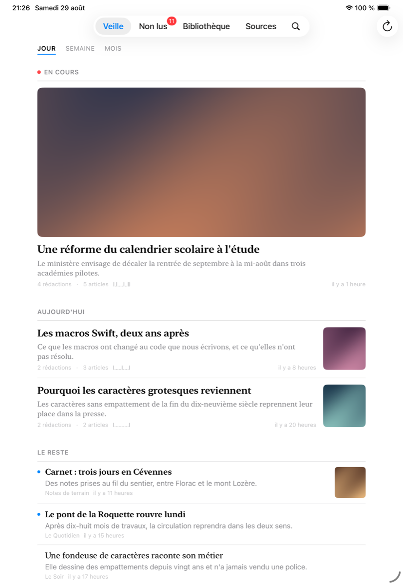
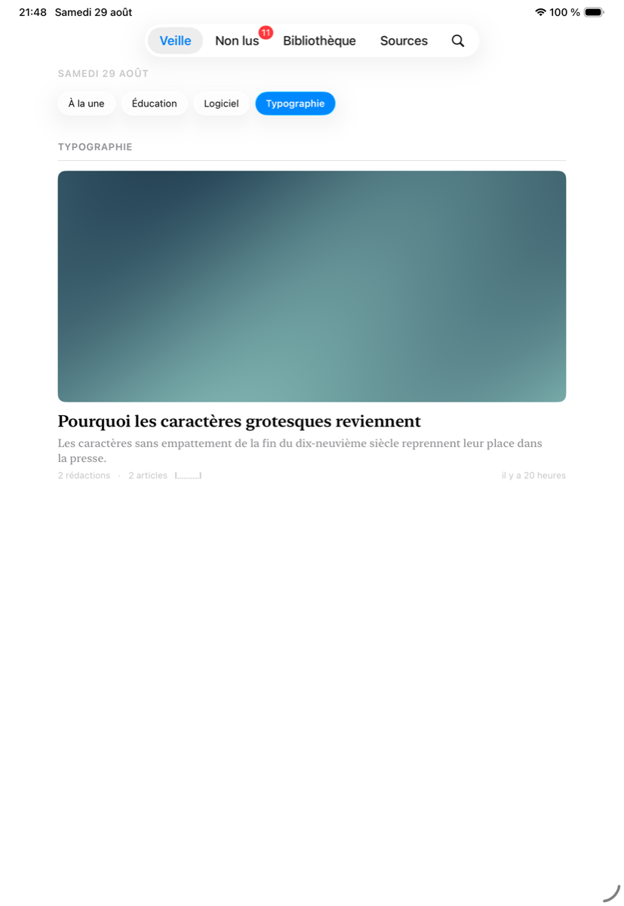
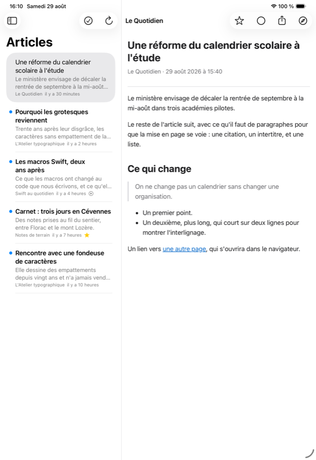
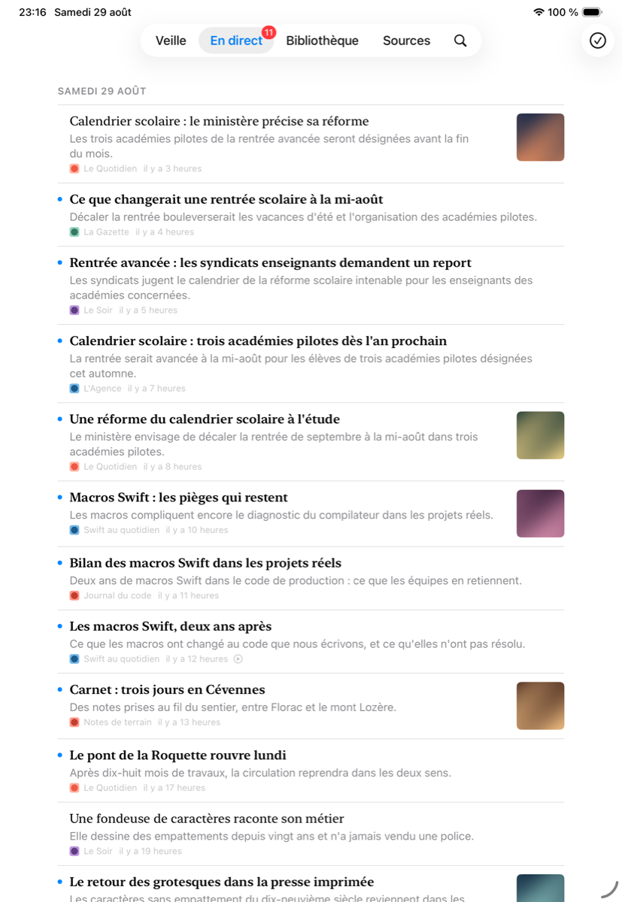
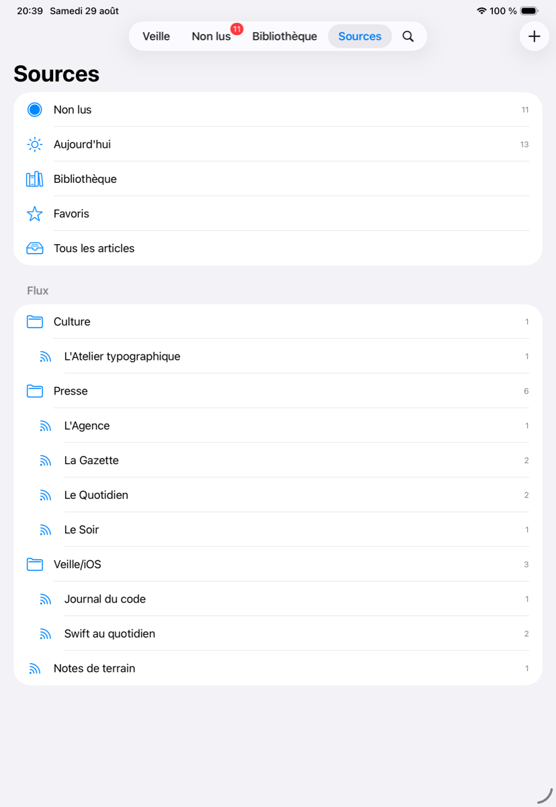
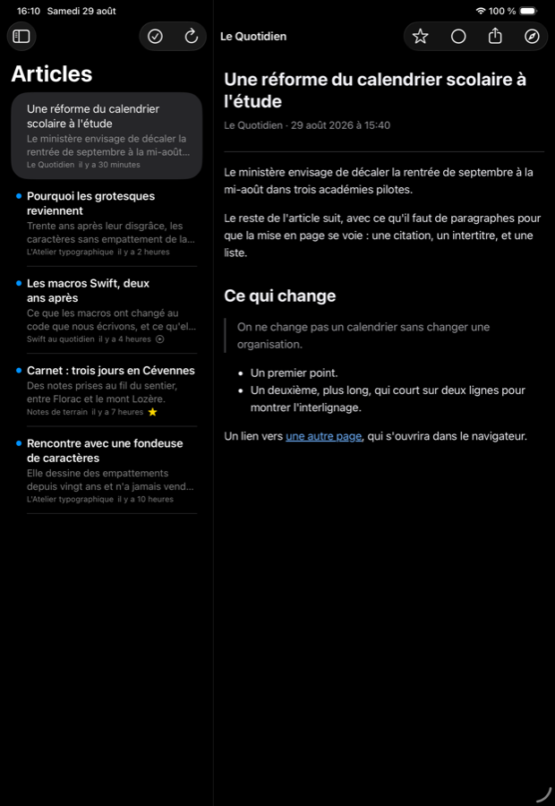

# Flong

A feed reader for iOS, iPadOS and macOS, written in Swift with SwiftUI and SQLite.

No server, no account, no hosting. Every device collects the feeds itself and keeps them in a local database ; what you choose to keep propagates through your own private CloudKit database.

> Status : early. Flong opens on a digest of what is happening rather than a list of what arrived, follows and fetches feeds, lets you read and search them by words or by meaning, keeps what you star, and carries your subscriptions, kept articles and read states between your own devices through iCloud.

## Ideas

**The main screen is a digest, not a list.** Its unit is the story : several articles, from several rooms, about one thing. What several rooms are covering right now is shown as it arrives, and what grouped with nothing is still there underneath. The system model sorts the page into subjects you can narrow it to. An aggregator shows what arrived and leaves you to work out what matters.

**Stream and library are two different things.** The stream is a disposable cache, rebuildable at any time from the sources, purged by age and volume. The library is what you chose to keep : its content is frozen at that moment, so it survives the article disappearing from its feed, and it is never purged.

**A truncated article is completed from its page.** Most feeds send a standfirst and a link. Open the article and Flong fetches the page behind it, once, keeps what it finds beside what the feed sent, and lets you read either.

**Search is genuinely indexed.** A full-text index over the whole local corpus, a query language with operators, and semantic search over the library through Spotlight.

**Enrichment happens on the device.** Classification, tagging and summaries come from the system model, in your own language whatever language the articles are in, and no article content is sent anywhere.

**It is set like a page, not like a control panel.** One column at a time, held to a readable measure, serif headlines, hairline rules, no cards and no boxes. Liquid Glass stays in the navigation layer, where Apple puts it, and never in the content.

## Screenshots

| The digest | A subject | A story |
| ---------- | --------- | ------- |
|  |  |  |

The pills are the subjects the system model found across the page, pinned at its head. Tapping one narrows the page to it ; the others stay, so there is always a way back. A long press says more of this, or less of this, and the page reorders itself.

| An article | Live | Sources |
| ---------- | ---- | ------- |
|  |  |  |

The same page on iPhone, where the sections sit in the system tab bar and search has its own place in it :

| The digest | A story | Search |
| ---------- | ------- | ------ |
|  |  |  |

Rendered articles follow the system appearance, light and dark :



The feeds shown are made up, every address in them points at `example.com`, and the pictures are generated : nothing here belongs to anybody.

## Platforms

| Platform | Minimum version |
| -------- | --------------- |
| iOS      | 26.0 |
| iPadOS   | 26.0 |
| macOS    | 26.0 |

A single SwiftUI codebase serves the three platforms, and no feature exists on macOS alone. The sections sit in the tab bar on iPhone and iPad, and in a sidebar on Mac. An iCloud account is needed to synchronize between devices, never to use the application.

## Requirements

- Xcode 26.5 or later
- An iCloud account, only to synchronize between devices : Flong is fully usable on one device without one

## Building

Open `Flong.xcodeproj` in Xcode and run the `Flong` scheme, or build from the command line :

```bash
export DEVELOPER_DIR=/Applications/Xcode.app/Contents/Developer
xcodebuild build -project Flong.xcodeproj -scheme Flong -destination 'generic/platform=iOS Simulator'
xcodebuild build -project Flong.xcodeproj -scheme Flong -destination 'platform=macOS'
```

The `DEVELOPER_DIR` export is only needed when `xcode-select` points at the Command Line Tools rather than at Xcode.

## Dependencies

| Package | Use |
| ------- | --- |
| [GRDB](https://github.com/groue/GRDB.swift) | SQLite access, migrations, and the FTS5 full-text index |

Everything else comes from the system frameworks.

## Privacy

No data leaves the device, apart from the private CloudKit database, the requests to the feeds themselves, and the pictures those feeds point at, which are asked for from the publisher when a screen shows one. No telemetry, no tracker, no third-party service active by default. Feed credentials and secret feed URLs live in the keychain only, and never appear in the database, in an export, or in a log.

## Other services

Flong is not a client for any service. FreshRSS, Miniflux, Feedbin and Feedly are supported as one-shot import sources only : subscriptions, folders, labels, stars and read states are retrieved once, after which Flong runs on its own.

## Localization

The interface is authored in English and translated to French. All strings live in `Flong/Localizable.xcstrings`.

## Documentation

| Document | Contents |
| -------- | -------- |
| [`docs/specification.md`](docs/specification.md) | The product and technical specification : the reference for every decision |
| [`CLAUDE.md`](CLAUDE.md) | Working conventions : architecture, guidelines, git and release workflow |
| [`CHANGELOG.md`](CHANGELOG.md) | Change history, following [Keep a Changelog](https://keepachangelog.com/) |
| [`docs/technical/feed-identity.md`](docs/technical/feed-identity.md) | How a feed is identified, and what happens when the same address is subscribed twice |
| [`docs/technical/opml.md`](docs/technical/opml.md) | What the OPML import reads, and how it copes with a malformed file |
| [`docs/technical/html.md`](docs/technical/html.md) | How feed HTML is parsed, and the whitelist it is reduced to |
| [`docs/technical/extraction.md`](docs/technical/extraction.md) | How the rest of a truncated article is fetched from its page |
| [`docs/technical/credentials.md`](docs/technical/credentials.md) | How a feed you pay for proves you are entitled to it |
| [`docs/technical/feed-formats.md`](docs/technical/feed-formats.md) | The formats Flong reads, and what it does with a broken one |
| [`docs/technical/fetching.md`](docs/technical/fetching.md) | How feeds are asked for, and how publishers are treated |
| [`docs/technical/ingestion.md`](docs/technical/ingestion.md) | What happens between a fetched feed and the store, and what bounds it |
| [`docs/technical/search.md`](docs/technical/search.md) | The index, the query language, and why nothing typed into it is ever run |
| [`docs/technical/library.md`](docs/technical/library.md) | What promotion copies, what keeps an article, and what Spotlight is told |
| [`docs/technical/sync.md`](docs/technical/sync.md) | What travels between devices, what never does, and why the record budget shapes it |
| [`docs/technical/background.md`](docs/technical/background.md) | How long work survives being interrupted, and how the library is searched by meaning |
| [`docs/technical/digest.md`](docs/technical/digest.md) | How articles become stories, and why not with the vectors |
| [`docs/technical/interface.md`](docs/technical/interface.md) | How the interface is set, where Liquid Glass is allowed, and what was rejected |
| [`docs/technical/freshrss-api.md`](docs/technical/freshrss-api.md) | The Google Reader API surface, kept for the FreshRSS import |

## License

Flong is released under the [Mozilla Public License 2.0](LICENSE). Modified Flong files must be published under the same license, while the rest of a larger work may carry another one.

Copyright (C) 2026 François Rousselet.
