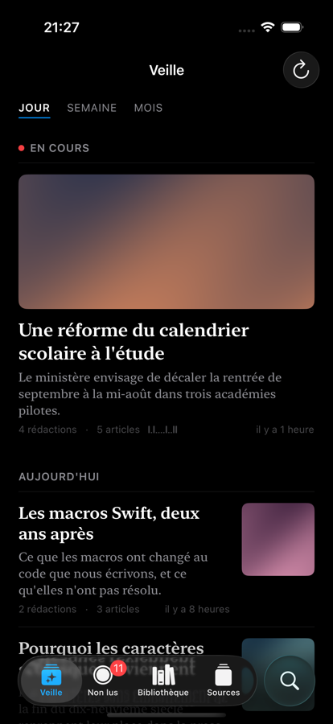
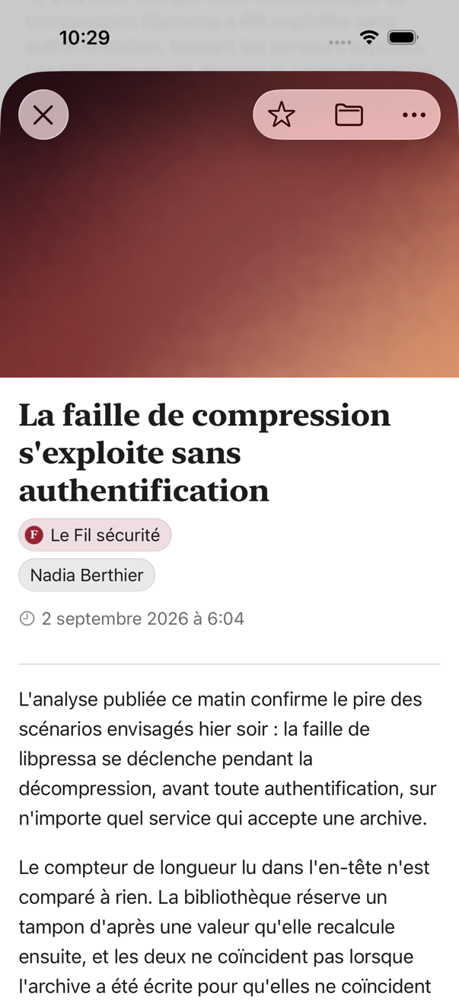
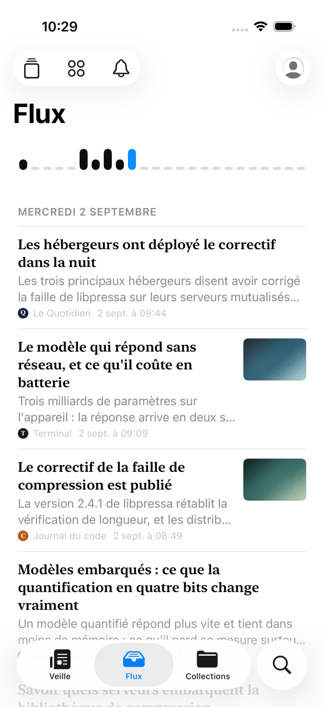

# Flong


A feed reader for iOS, iPadOS and macOS, written in Swift with SwiftUI and SQLite.

No server, no account, no hosting. Every device collects the feeds itself and keeps them in a local database ; what you choose to keep travels between your own devices through your private CloudKit database.

> **Status : early.** Flong follows feeds, opens on a digest of what is happening rather than a list of what arrived, lets you read and search, and carries your subscriptions, your marks and your read states between your devices.

## What it does

**The front page is a digest, not a list.** Its unit is the story : several articles, from several rooms, about one thing. An aggregator shows what arrived and leaves you to work out what matters.

**The page is sorted into subjects.** Pills at its head narrow it to one of them, and a long press asks for more of this, or less of this.

**Sources are grouped by publisher.** A paper with a feed per desk is one heading, worked out from the address it serves them at, so the list is organized the moment you subscribe.

**You can follow a writer rather than a paper.** Every byline your feeds have signed is searchable, and singling one out gives you everything that person wrote, wherever it appeared.

**And you can follow whoever the news is about.** No feed says who an article is about, so Flong reads the people out of the headline and the prose itself, on your device and without Apple Intelligence. Look somebody up and you get every paper writing about them, whoever signed it.

**It tells you when there is something new.** One switch covers every source you follow. Under it, the finer instrument : ask it of a newsletter, a blog or a colleague and every article they put out is announced as it arrives ; ask it of a person you read about and you hear whenever anybody writes about them. The front page is the press covering one thing ; this is the one voice, or the one name, you did not want to miss. Asking several ways about the same article still tells you once.

**What you mark stays.** Star an article, write on it, file it in a collection : the mark rides on the article itself, follows you to your other devices, and no purge ever touches it.

**Search takes a sentence.** Ask for the articles from Le Monde about the rentrée scolaire and that is what you get : the sentence is read on your device into a paper, a subject, a date, and it tells you what it understood. It works without Apple Intelligence too. The section opens with the cursor in the field, suggests what is worth looking for this morning from what your feeds are full of, and keeps what you searched for so you never type it twice. Full text over the whole local corpus, and what you marked reaches Spotlight.

**Sources you pay for stay readable.** A per-subscriber address, HTTP Basic or a token, kept in the keychain and never in the database, an export or a log.

**The readers suggest sources to each other.** Beside an address and an OPML file there is a third way in : the feeds enough other readers follow. Anybody can see the list ; adding to it takes an invitation, since every member can bring in twenty people and each of them answers for who they brought. A source is suggested once ten members follow it. You are asked once before anything of yours goes in, only addresses ever travel, and a source whose address is a secret, one behind a password and one carrying a parameter you marked as yours are never shared.

**A collection can be shared**, through the system's own share sheet. What travels is the excerpt the feed published, never the article, because the article is not yours to hand anybody. Everybody in it is shown on its square and along the top of it, under the face and the name each of them chose, and whoever shared it can take somebody back out. What you filed and what everybody else filed is one list in date order ; an article you follow the source of is your own copy, and one you do not opens in the reader all the same, signed in where you have signed in. You take back what you put in, and whoever shared the collection can take out anything.

**Enrichment happens on the device.** Headlines, summaries and filing come from the system model, in your own language whatever language the articles are in, and no article content is sent anywhere.

**And you can see what it all adds up to.** A page of figures beside your own face, over a day, a season or the lot : the articles received, the sources they came from, the hour of the day, the day of the week and the day of the month your feeds are busiest, the subjects, the people, the authors, the languages and how many arrived twice. No unread count, no streak, nothing that scores you.

**It is set like a page**, not like a control panel : one column, a readable measure, hairline rules, serif headlines over a sans body. Three themes, each stating both appearances.

## Screenshots

| The digest | A story | An article |
| ---------- | ------- | ---------- |
|  |  |  |

| The stream | Search | The same page, in the dark |
| ---------- | ------ | ------------------------- |
|  |  |  |

The feeds shown are made up, every address in them points at `example.com`, and the pictures are generated : nothing here belongs to anybody.

## Platforms

iOS, iPadOS and macOS, 26.0 or later.

One SwiftUI codebase serves the three, and no feature exists on macOS alone : the sections sit in the tab bar on iPhone and iPad, and in a sidebar on Mac. An iCloud account is needed to synchronize between devices, never to use the application.

## Building

Xcode 26.5 or later. Open `Flong.xcodeproj` and run the `Flong` scheme, or build from the command line :

```bash
xcodebuild build -project Flong.xcodeproj -scheme Flong -destination 'generic/platform=iOS Simulator'
xcodebuild build -project Flong.xcodeproj -scheme Flong -destination 'platform=macOS'
```

[GRDB](https://github.com/groue/GRDB.swift) is the only dependency, for SQLite access, migrations and the full-text index. Everything else comes from the system frameworks.

## Privacy

Nothing leaves the device but your own private CloudKit database, a collection you chose to share, the requests to the feeds themselves, and the pictures those feeds point at. Flong asks for your contacts only to put a name on somebody you invited to a collection and who has not accepted yet, only when there is one, and what it finds never leaves the device. No telemetry, no tracker, no third-party service.

The popular feeds are the one thing you may publish to other readers, and only after saying so : a list of the addresses you follow, never a name, an article or anything you wrote. Turning it off takes your list back out.

Feed credentials and secret feed addresses live in the keychain only. Where you say you read from is the name of a town and the code of a country, never a coordinate.

There is no account to close, so the reader's panel deletes everything instead, from the page it keeps for what this device and your iCloud hold : the database, the keychain, the preferences, the Spotlight index, the CloudKit zone, the archive, and the list of addresses you were offering the other readers.

## Other services

Flong is not a client for any service. FreshRSS, Miniflux, Feedbin and Feedly are one-shot import sources : subscriptions, labels, stars and read states are read once, after which Flong runs on its own.

## Documentation

| Document | Contents |
| -------- | -------- |
| [`docs/specification.md`](docs/specification.md) | The product and technical specification : the reference for every decision |
| [`docs/technical/`](docs/technical/) | One page per subject : feed identity, fetching, ingestion, search, marks, sync, sharing, popular feeds, the digest, authors, newsmakers, the statistics, the interface, erasure |
| [`CHANGELOG.md`](CHANGELOG.md) | Change history, following [Keep a Changelog](https://keepachangelog.com/) |
| [`CLAUDE.md`](CLAUDE.md) | Working conventions : architecture, guidelines, git and release workflow |

The interface is authored in English and translated to French. All strings live in `Flong/Localizable.xcstrings`.

## License

Flong is released under the [Mozilla Public License 2.0](LICENSE). Modified Flong files must be published under the same license, while the rest of a larger work may carry another one.

Copyright (C) 2026 François Rousselet.
